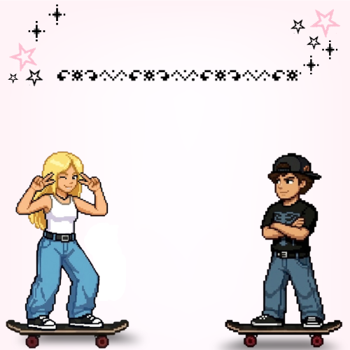

# Pixel Skate



---

## Identificação do Projeto

**Nome do Projeto:** Pixel Skate
**Desenvolvedora:** Clarice
**Tipo:** Jogo 2D desenvolvido com JavaScript e Canvas

---

## Visão Geral do Sistema

Pixel Skate é um jogo 2D onde o jogador controla um skatista em uma pista urbana.
O objetivo é desviar de obstáculos, coletar itens e sobreviver o maior tempo possível enquanto a dificuldade aumenta progressivamente.

---

## Objetivo do Jogo

* Desviar dos inimigos
* Coletar corações para recuperar vida 
* Acumular pontos
* Sobreviver às fases com dificuldade crescente

---

## Modos de Jogo

* **Singleplayer:** controle de um personagem
* **Multiplayer:** dois jogadores na mesma partida

---

## Instruções de Jogabilidade

### Player 1:

* ⬅️ ➡️ : movimentar
* ⬆️ : pular

### Player 2:

* A / D : movimentar
* W : pular

---

## Mecânicas do Jogo

* Sistema de vidas
* Sistema de pontuação (+5 por obstáculo desviado)
* Coletáveis (coração +1 vida)
* Progressão de fases
* Aumento de dificuldade
* Troca de cenário conforme a fase
* Colisão com inimigos reduz vida

---

## Telas do Sistema

* Menu Inicial
* Seleção de personagem
* Tela de jogo
* Tela de "Como Jogar"
* * Tela "Sobre o Desenvolvedor" (com dados do aluno e professor)
* Tela de vitória
* Tela de derrota

---

## Tecnologias Utilizadas

* JavaScript
* HTML5
* Canvas API
* Programação Orientada a Objetos (POO)

---

## Requisitos do Sistema

### Requisitos Funcionais 
* Movimentação:
O jogador pode se mover para a esquerda, direita e pular (setas ou WASD no multiplayer).
Sistema de Vidas:
Os jogadores começam com 5 vidas e perdem 1 ao colidir com obstáculos.
Pontuação:
O jogador ganha pontos ao ultrapassar inimigos durante a partida.

* Coletáveis (Corações):
Itens que aparecem na pista e aumentam a vida do jogador ao serem coletados.

* Modos de Jogo:
O jogo possui dois modos:
Singleplayer (1 jogador)
Multiplayer (2 jogadores)

* Progressão de Fases:
O jogo possui fases com dificuldade crescente baseada na pontuação.

* Interface (Telas):
O sistema possui diferentes telas:
Menu inicial
Seleção de personagem
Tela de jogo
Tela "Como Jogar"
Tela "Sobre"
Tela de vitória e derrota

* Sistema de Colisão:
Detecta interações entre:
Jogadores e inimigos
Jogadores e itens coletáveis

* Sistema de Áudio:
O jogo possui sons para ações como:
Movimento
Pulo
Colisão
Vitória e derrota

###  Regras de Negócio 
* Dificuldade Progressiva:
A cada fase, os inimigos ficam mais rápidos e mais numerosos.

* Mudança de Cenário:
O fundo do jogo muda conforme a fase.

* Condição de Vitória (Singleplayer):
O jogador vence ao atingir a pontuação necessária.

* Condição de Derrota (Singleplayer):
O jogo termina quando a vida do jogador chega a zero.

* Condição de Vitória (Multiplayer):
O jogo termina quando um dos jogadores perde todas as vidas.

* Condição de Derrota (Multiplayer)
O outro jogador é o vencedor.

* Spawn de Inimigos:
Os inimigos só aparecem se:
Não ultrapassarem o limite máximo
Respeitarem uma distância mínima entre si

* Spawn de Corações:
Os corações aparecem de forma aleatória e com baixa chance.

* Pontuação por Desvio:
O jogador só ganha pontos quando ultrapassa completamente um inimigo.

* Controle de Estados:
O jogo funciona com diferentes estados:
menu
menu de personagem
jogo
como jogar
sobre

###  Requisitos Não Funcionais 
* Desempenho:
O jogo utiliza requestAnimationFrame para garantir animação fluida.

* Usabilidade:
Interface simples, clara e fácil de usar, com controles intuitivos.

* Portabilidade:
O jogo roda diretamente no navegador, sem necessidade de instalação.

* Confiabilidade:
O sistema controla corretamente estados do jogo, evitando erros durante a execução.

* Manutenibilidade:
O código é organizado usando Programação Orientada a Objetos (POO), facilitando futuras melhorias.

---

## Especificações Técnicas

- O jogo possui sistema de fases baseado em pontuação
- A velocidade dos inimigos aumenta progressivamente
- O número de inimigos cresce conforme a fase
- O jogador inicia com 5 vidas
- A pontuação é aumentada ao ultrapassar obstáculos

---

## Estrutura do Projeto

```bash
game_skate/
│
├── index.html
├── index.js
├── style.css
│
├── models/
│   └── Skatista.js
│
├── imgs/
├── fonts/
│
├── UML/
│   ├── caso_de_uso.png
│   ├── diagrama_sequencia.png
│
└── README.md
```

---

##  Como Executar o Projeto

###  1. Clonar o repositório

```bash
git clone https://github.com/clariceheitmann/game_skate_atualizado.git
```

### 2. Abrir a pasta

Abra no VS Code ou outro editor

###  3. Executar

Abra o arquivo:

```bash
index.html
```

---

## Link do Projeto 

https://game-skate-atualizado.vercel.app/

---

## Sobre a Desenvolvedora

**Nome:** Clarice Heitmann Santos
**GitHub:** https://github.com/clariceheitmann
**Email:** [clarice_h_santos@estudante.sesisenai.org.br](mailto:clarice_h_santos@estudante.sesisenai.org.br)

---

## Créditos

Projeto desenvolvido como parte da disciplina de Programação Orientada a Objetos.
**Product Owner (Professor):** Carlos Roberto da Silva Filho

---

## Considerações Finais

O projeto Pixel Skate foi desenvolvido com o objetivo de aplicar conceitos de lógica de programação, orientação a objetos e desenvolvimento de jogos utilizando JavaScript e Canvas, proporcionando uma experiência interativa e divertida.

---
